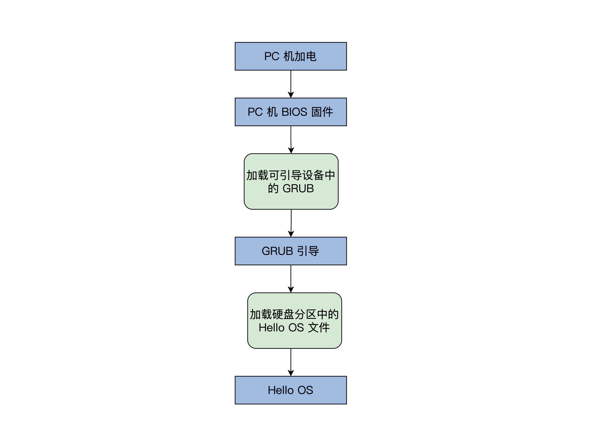
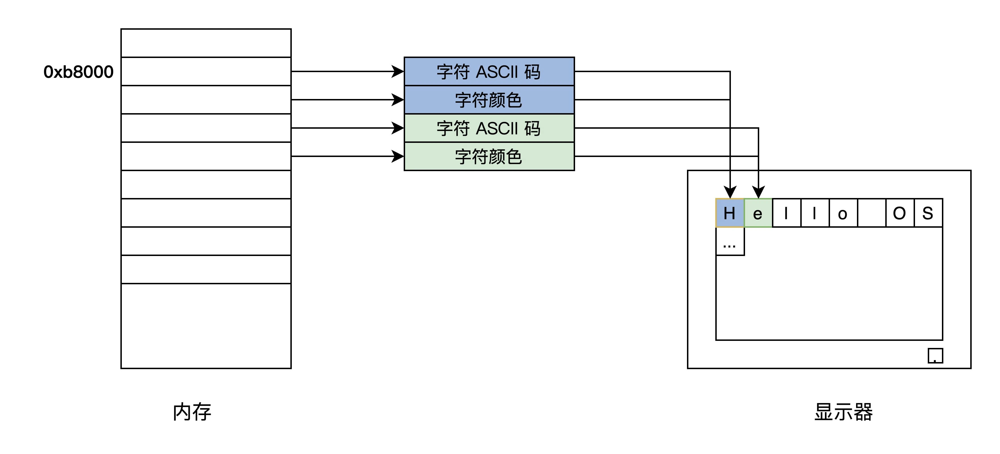
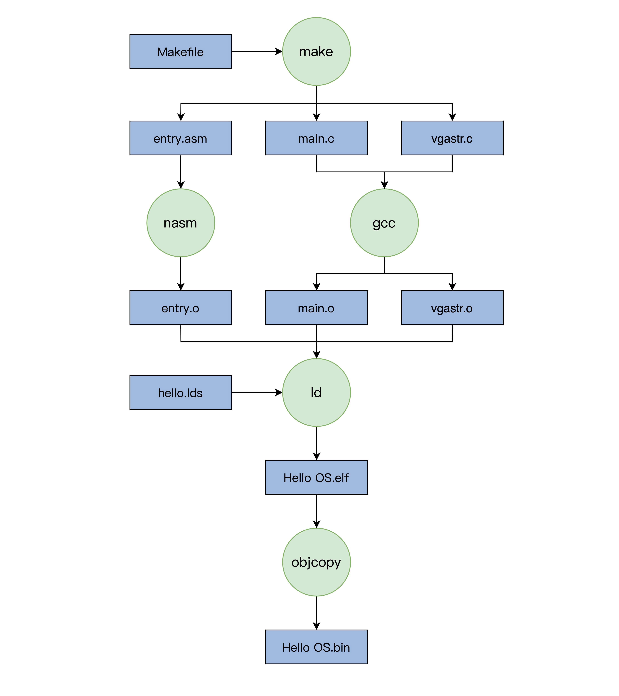
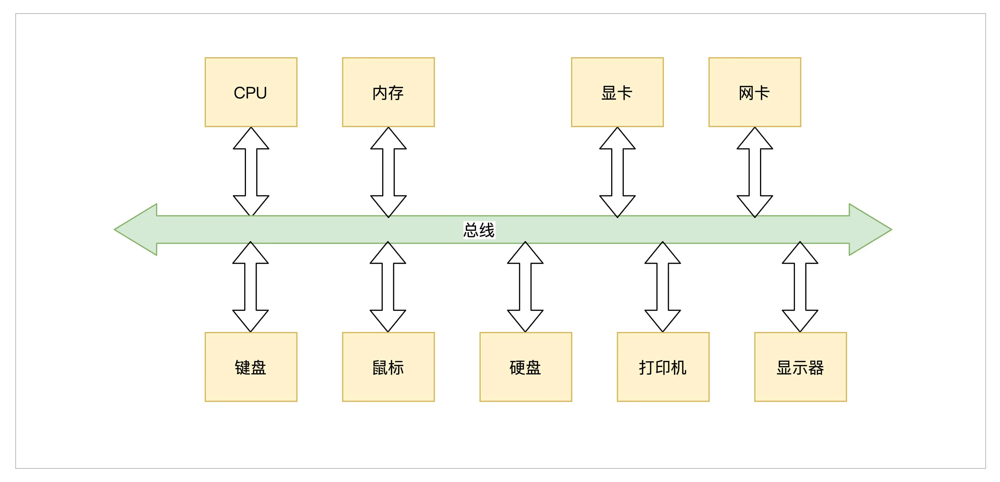
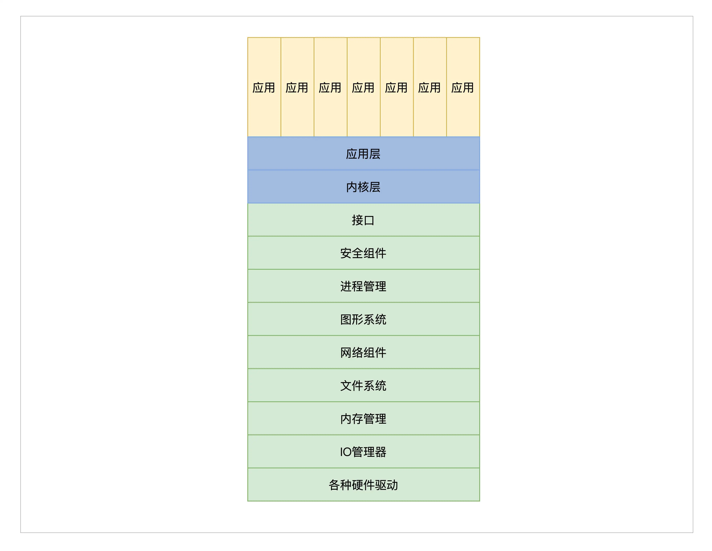
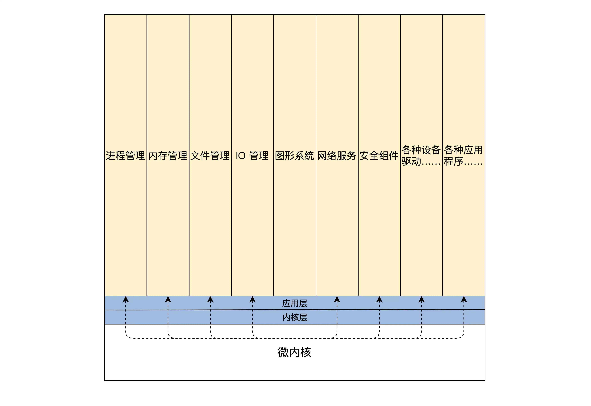

# 操作系统实战学习

## 2. 实现一个最简单的内核

* 该内核的名称叫**Hello OS**。

* 由于知识储备不够，暂时先不从PC的引导程序开始写起，而是借用Ubuntu Linux 操作系统带的GRUB引导程序。

* **引导流程**：

  

* **不懂知识点**：

  * BIOS：基本输入输出系统
  * PC机的BIOS固件是固化在PC机主板上的ROM芯片中的，掉电也能保存，PC机上电后的第一条指令就是BIOS固件中 ，它负责**检测和初始化CPU、内存及主板平台**，然后加载引导设备(大概率是硬盘)中的第一个扇区数据，到0x7c00地址开始的内存空间，再接着跳转到0x7c00处执行命令，在我们这里的情况下就是GRUB引导程序。当然更先进的UEFI BIOS则不同，这里就不深入其中了。可以通过这个<a href="https://uefi.org/">链接</a>去拓展学习。

* **Hello OS 引导汇编代码**：

  * 问题：为什么不直接用C？

    答：C作为通用的高级语言，不能直接操作特定的硬件，而且C语言的函数调用、函数传参，都需要用栈。栈简单来说就是一块内存空间，其中数据满足后进先出的特性，它由CPU特定的栈寄存器指向，所以我们要先用汇编代码处理好这些C语言的工作环境。

  * 代码：

    ```assembly
    MBT_HDR_FLAGS EQU 0x00010003
    MBT_HDR_MAGIC EQU 0x1BADB002 ;多引导协议头魔数
    MBT_HDR2_MAGIC EQU 0xe85250d6 ;第二版多引导协议头魔数
    global _start ;导出_start符号
    extern main ;导入外部的main函数符号
    [section .start.text] ;定义.start.text代码节
    [bits 32] ;汇编成32位代码
    _start:
    jmp _entry
    ALIGN 8
    mbt_hdr:
    dd MBT_HDR_MAGIC
    dd MBT_HDR_FLAGS
    dd -(MBT_HDR_MAGIC+MBT_HDR_FLAGS)
    dd mbt_hdr
    dd _start
    dd 0
    dd 0
    dd _entry
    ;以上是GRUB所需要的头
    ALIGN 8
    mbt2_hdr:
    DD MBT_HDR2_MAGIC
    DD 0
    DD mbt2_hdr_end - mbt2_hdr
    DD -(MBT_HDR2_MAGIC + 0 + (mbt2_hdr_end - mbt2_hdr))
    DW 2, 0
    DD 24
    DD mbt2_hdr
    DD _start
    DD 0
    DD 0
    DW 3, 0
    DD 12
    DD _entry
    DD 0
    DW 0, 0
    DD 8
    mbt2_hdr_end:
    ;以上是GRUB2所需要的头
    ;包含两个头是为了同时兼容GRUB、GRUB2
    ALIGN 8
    _entry:
    ;关中断
    cli
    ;关不可屏蔽中断
    in al, 0x70
    or al, 0x80
    out 0x70,al
    ;重新加载GDT
    lgdt [GDT_PTR]
    jmp dword 0x8 :_32bits_mode
    _32bits_mode:
    ;下面初始化C语言可能会用到的寄存器
    mov ax, 0x10
    mov ds, ax
    mov ss, ax
    mov es, ax
    mov fs, ax
    mov gs, ax
    xor eax,eax
    xor ebx,ebx
    xor ecx,ecx
    xor edx,edx
    xor edi,edi
    xor esi,esi
    xor ebp,ebp
    xor esp,esp
    ;初始化栈，C语言需要栈才能工作
    mov esp,0x9000
    ;调用C语言函数main
    call main
    ;让CPU停止执行指令
    halt_step:
    halt
    jmp halt_step
    GDT_START:
    knull_dsc: dq 0
    kcode_dsc: dq 0x00cf9e000000ffff
    kdata_dsc: dq 0x00cf92000000ffff
    k16cd_dsc: dq 0x00009e000000ffff
    k16da_dsc: dq 0x000092000000ffff
    GDT_END:
    GDT_PTR:
    GDTLEN dw GDT_END-GDT_START-1
    GDTBASE dd GDT_START
    ```

    * 1~40行，用汇编定义的GRUB的多引导协议头，其实就是一定格式的数据，我们的Hello OS是用GRUB引导的，当然要遵循**GRUB的多引导协议标准**，让GRUB能识别我们的Hello OS，之所以有两个引导头，是为了兼容GRUB1和GRUB2。
    * 44~52行，关掉中断，设定CPU的工作模式。
    * 54~73行，初始化CPU的寄存器和C语言的运行环境。
    * 78~87行，GDT_START开始的，是CPU工作模式所需要的数据。

* **Hello OS的主函数**：

  * 在上面的汇编代码中调用main函数，而在其代码中并没有函数体，而是从外部引了一个符号。那是因为这个函数是用C语言写的，最终它们分别由nasm和GCC编译成可链接模块，由LD链接器链接在一起，形成可执行的程序文件：

    ```c
    #include "vgastr.h"
    void main()
    {
      printf("Hello OS!");
      return;
    } 
    ```

    以上这段代码，不是应用程序的main函数，而是Hello OS的main函数。其中printf也不是应用程序库中的那个printf了，而是需要我们自己实现了。

* **控制计算机屏幕**：

  * 计算机屏幕的显示往往是显卡的输出。

  * 显卡的形式(性能由低到高，价格也是)：

    1. 集显：集成在主板的
    2. 核显：做在CPU芯片内的
    3. 独显：独立存在通过PCIE接口连接的

  * 要在屏幕上显示字符，就要编程操作显卡。

  * 无论我们PC机上是什么显卡，它们都支持一种叫**VESA**的标准，这种标准下有两种工作模式：字符模式和图形模式。显卡们为了兼容这种标准，不得不自己提供一种叫VGABIOS的固件程序。

  * 以下是显卡的字符模式的工作细节：

    把屏幕分成24行，每行80个字符，把这(24*80)个位置映射到以0xb8000地址开始的内存中，每两个字节对应一个字符，其中一个字节是字符的ASCII码，另一个字节为字符的颜色值。如下图所示：

    

  * 代码：

    * 注意：C语言的字符串是以0结尾的，其字符编码通常是utf8，而utf8编码对ASCII字符是兼容的，即英文字符的ASCII编码和utf8编码是相等的。

    ```c
    void _strwrite(char* string)
    {
      char* p_strdst = (char*)(0xb8000);//指向显存的开始地址
      while (*string)
      {
        *p_strdst = *string++;
        p_strdst += 2;
      }
      return;
    }
    
    void printf(char* fmt, ...)
    {
      _strwrite(fmt);
      return;
    }
    ```

    * printf函数直接调用了\_strwrite函数，而\_strwrite函数正是将字符串里每个字符依次定入到0xb8000地址开始的显存中，而p_strdst每次加2，这也是为了跳过字符的颜色信息的空间。

  下面开始编译和安装：

* **编译和安装Hello OS**：

  * 在安装前先进行系统编译，把每个代码模块编译最后链接成可执行的二进制文件。

  * Ps：可能我们会觉得编译不就是输入几条命令吗，这么简单的工作也值得一说？

    答：对于我们上面写的简单Hello OS来说确实简单，因为总共才三个代码文件，最多四条指令就可以完成。但是以后我们的Hello OS的文件数量会爆炸式增长，一个成熟的操作系统更是多达几万个代码模块文件，几千万行代码量，是这世间最复杂的软件工程之一。所以需要一个牛逼的工具来控制这个巨大的编译过程。

* **make工具**：

  * make历史悠久，小巧方便，也是很多成熟操作系统编译所使用的构建工具。

  * 在软件开发中，make是一个工具程序，它读取一个叫”makefile“的文件，也是一种文本文件，这个文件中写好了构建软件的规则，它能根据这些规则自动化构建软件。

  * makefile文件中规则是这样的：首先有一个或多个构建目标称为”target“，目标后面紧跟着用于构建该目标所需要的文件，目标下面是构建该目标所需要的命令及参数。

  * 与此同时，它也检查文件的依赖关系，如果需要的话，它会调用一些外部软件来完成任务。

  * 第一次构建目标后，下一次执行make时，它会根据该目标所依赖的文件是否更新决定是否编译该目标，如果所依赖的文件没有更新且该目标又存在，那么它便不会构建该目标。这种特性非常有利于编译程序源代码。

  * 任何一个Linux发行版中都默认自带这个make程序，所以不需要额外的安装工作，我们直接使用即可。

  * 下面是一个makefile的例子：

    ```assembly
    
    CC = gcc #定义一个宏CC 等于gcc
    CFLAGS = -c #定义一个宏 CFLAGS 等于-c
    OBJS_FILE = file.o file1.o file2.o file3.o file4.o #定义一个宏
    .PHONY : all everything #定义两个伪目标all、everything
    all:everything #伪目标all依赖于伪目标everything
    everything :$(OBJS_FILE) #伪目标everything依赖于OBJS_FILE，而OBJS_FILE是宏会被
    #替换成file.o file1.o file2.o file3.o file4.o
    %.o : %.c
       $(CC) $(CFLAGS) -o $@ $<
    ```

    解释：

    *  make 规定“#”后面为注释，make 处理 makefile 时会自动丢弃。 
    *  makefile 中可以定义宏，方法是在一个字符串后跟一个“=”或者“:=”符号，引用宏时要用“$(宏名)”，宏最终会在宏出现的地方替换成相应的字符串，例如：$(CC) 会被替换成 gcc，$( OBJS_FILE) 会被替换成 file.o file1.o file2.o file3.o file4.o。 
    *  .PHONY 在 makefile 中表示定义伪目标。所谓伪目标，就是它不代表一个真正的文件名，在执行 make 时可以指定这个目标来执行其所在规则定义的命令。但是伪目标可以依赖于另一个伪目标或者文件，例如：all 依赖于 everything，everything 最终依赖于 file.c file1.c file2.c file3.c file4.c。 
    *  虽然我们会发现，everything 下面并没有相关的执行命令，但是下面有个通用规则：“%.o : %.c”。其中的“%”表示通配符，表示所有以“.o”结尾的文件依赖于所有以“.c”结尾的文件。 例如：file.c、file1.c、file2.c、file3.c、file4.c，通过这个通用规则会自动转换为依赖关系：file.o: file.c、file1.o: file1.c、file2.o: file2.c、file3.o: file3.c、file4.o: file4.c。  
    *  然后，针对这些依赖关系，分别会执行：$(CC) $(CFLAGS) -o $@ $< 命令，当然最终会转换为：gcc –c –o xxxx.o xxxx.c，这里的“xxxx”表示一个具体的文件名。 

* **编译**：

  编译过程见下图：

  

  在代码文件夹中：

  1. 安装nasm，才能执行make：`sudo apt-get install -y nasm`安装nasm
  2. 执行make得到HelloOS.bin文件：make -f Makefile

  文件解释：

  * hello.Ids：链接器脚本，用于指导链接过程，设定不同程序段的布局。
  * Makefile：编译脚本，用于指导编译过程。

* **安装Hello OS**：

  * 经过上述流程，我们就会得到Hello OS.bin文件，但是我们还要让GRUB能够找到它，才能在计算机启动时加载它，这个过程我们称为安装，不过这里没有写安装程序，得我们手动来做。

  * 经研究发现，GRUB在启动时会加载一个grub.cfg的文本文件，根据其中的内容执行相应的操作，其中一部分内容就是启动项。

  * GRUB首先会显示启动项到屏幕，然后让我们选择启动项，最后GRUB根据启动项对应的信息，加载OS文件到内存。

  * 下面是Hello OS的启动项：

    ```assembly
    
    menuentry 'HelloOS' {
         insmod part_msdos #GRUB加载分区模块识别分区
         insmod ext2 #GRUB加载ext文件系统模块识别ext文件系统
         set root='hd0,msdos4' #注意boot目录挂载的分区，这是我机器上的情况
         multiboot2 /boot/HelloOS.bin #GRUB以multiboot2协议加载HelloOS.bin
         boot #GRUB启动HelloOS.bin
    }
    ```

  * 查看boot目录挂载的分区，在linux系统的终端下输入命令`df /boot/`

    ```c
    
    文件系统          1K-块    已用     可用      已用% 挂载点
    /dev/sda4      48752308 8087584 38158536   18%    /
    ```

     其中的“sda4”就是硬盘的第四个分区（硬件分区选择 MBR），但是 GRUB 的 menuentry 中不能写 sda4，而是要写“hd0,msdos4”，这是 GRUB 的命名方式，hd0 表示第一块硬盘，结合起来就是第一块硬盘的第四个分区。 

     把上面启动项的代码插入到你的 Linux 机器上的 /boot/grub/grub.cfg 文件末尾，然后把 Hello OS.bin 文件复制到 /boot/ 目录下，一定注意这里是追加不是覆盖。最后重启计算机，你就可以看到 Hello OS 的启动选项了。 

     选择 Hello OS，按下 Enter 键（或者重启按 ESC 键），这样就可以成功启动我们自己的 Hello OS 了。 

  * 运行结果：

    

* **拓展知识**：

  * 从按下PC机电源开关开始，PC机的引导过程：它从CPU上电，到加载BIOS固件，再由BIOS固件对计算机进行自检和默认的初始化，并加载GRUB引导程序，最后再由GRUB加载具体的操作系统。

* **本节课总结**：

  1. 用汇编程序初始化CPU的寄存器、设置CPU的工作模式和栈，最重要的是**加入了GRUB引导协议头**。
  2. 切换到C语言，用C语言写好了主函数和控制显卡输出的函数，其间还了解了显卡的一些工作细节。
  3. 编译和安装Hello OS。用make工具编译整个代码，其实make会根据一些规则调用具体的nasm、gcc、Id等编译器，然后形成Hello OS.bin文件，把这个文件复制到boot分区，写好GRUB启动项，就好了。

## 3. 内核结构与设计

* **经典计算机结构图**：

  

  ​	硬件资源：

  * 总线：负责连接各种其他设备，是其他设备工作的基础
  * CPU：中央处理器，负责执行程序和处理数据运算
  * 内存：负责储存运行时的代码和数据
  * 硬盘：负责长久储存用户文件数据
  * 网卡：负责计算机与计算机之间的通信
  * 显卡：负责显示工作
  * 各种I/O设备：如显示器、打印机、键盘、鼠标等

* **内核内部组成**：

  1. 管理CPU
  2. 管理内存
  3. 管理硬盘
  4. 管理显卡
  5. 管理网卡
  6. 管理各种I/O设备

  拓展：内核想要管理不同的硬件编写的代码通常称为<font color = red>驱动程序</font>

* **经典的内核结构**：

  1. **宏内核结构**：

     * 特点：大，简单适用，最早的一种结构
     * 描述：将诸如管理进程的代码、管理内存的代码、管理各种I/O设备的代码以及其他功能模块的代码经过编译后链接在一起，形成一个大的可执行文件。

     

     * 图中一层一层的并不是表明层次关系，而是表示它们链接在一起。

     * 工作例子：

       宏内核提供内存分配功能的服务过程：

       1. 应用程序调用内存分配的API函数
       2. 处理器切换到特权模式，开始运行内核代码
       3. 内核里的内存管理代码按照特定的算法，分配一块内存
       4. 把分配的内存块的首地址返回给内存分配的API函数
       5. 内存分配的API函数返回，处理器开始运行用户模式下的应用程序，应用程序就得到了一块内存的首地址，并且可以使用这块内存了

     * 缺点：没有模块化、没有移植性，高度耦合在一起。

     * 优点：性能好(组件可以相互调用)

  2. **微内核结构**：

     * 特点：功能少(仅仅有进程调度、处理中断、内存空间映射、进程间通信等功能)
     * 描述：将实际的进程管理、内存管理、设备管理、文件管理等服务功能，做成一个个服务进程。宏内核提供的服务将在微内核架构里由这些服务进程专门负责完成。

     

     * 微内核定义了一个良好的进程间通信机制——<font color = blue>消息</font>。当应用程序需要请求相关服务时，就向微内核发送一条与此服务对应的消息，微内核再把这条消息转发给相关的服务进程，接着服务进程会完成相关的服务。

     * 工作例子：

       微内核提供内存分配功能的服务过程：

       1. 应用程序使用微内核提供的函数发送内存分配的消息
       2. 处理器切换到特权模式，开始运行内核代码
       3. 微内核代码让当前进程停止运行，并根据消息包中的消息，发现消息是发送给内存管理服务进程的，将消息交由内存管理服务进程
       4. 内存管理服务进程收到消息，分配一块内存
       5. 内存管理服务进程也通过消息的方式返回分配的内存块的地址给内核，然后继续等待下一条消息
       6. 微内核把包含内存块地址的消息返回给发送内存分配消息的应用进程
       7. 处理器开始运行用户模式下的应用程序，应用程序就得到了一块内存的首地址，并可以使用这块内存

     * 缺点：性能低(拐来拐去，一来一去的消息带来了非常大的开销，再加上各个服务进程的切换)

     * 优点：代码量少、伸缩性、可扩展性强